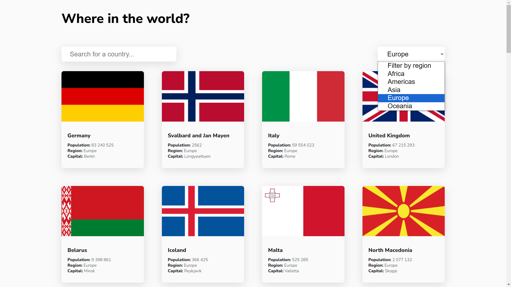
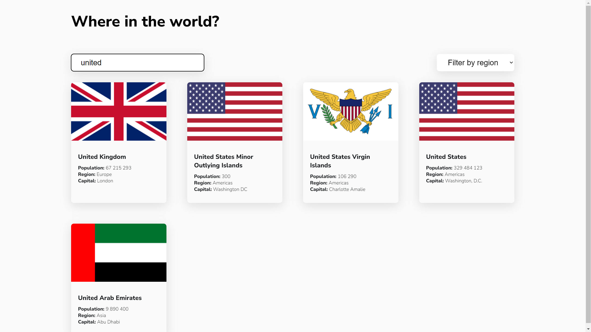
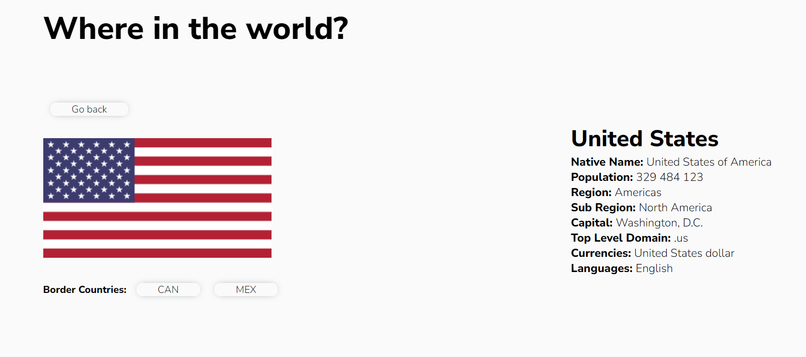

# FlagsApp

## Screenshots

    </img>
     
    </img>
     
    </img>

## Description

- Web app idea taken as a "challange" from FrontendMentor.
- Website contains information about all countries in the world, their flag, population, capital, native language, currency and more!
- Use searchbar or region filter to find the country you're looking for.
- (Created whole app using vanilla JS just to try working with API without frameworks like React, to increase my skills and data transfer understanding)

#### Technology used:
- HTML
- SCSS
- JS
- API

## What I Learned

- Working with API, fetching data from backend and create structure based on given designs.
- Planning how the application should work using pure JavaScript.
- Building functions that are creating HTML advanced content in JavaScript.

## Author info

- **Name:** Filip Bereszyński
- **Age:** 21 years old
- **Contact:**
    - bereszynski.filip@gmail.com
    - (+48) 510 240 074